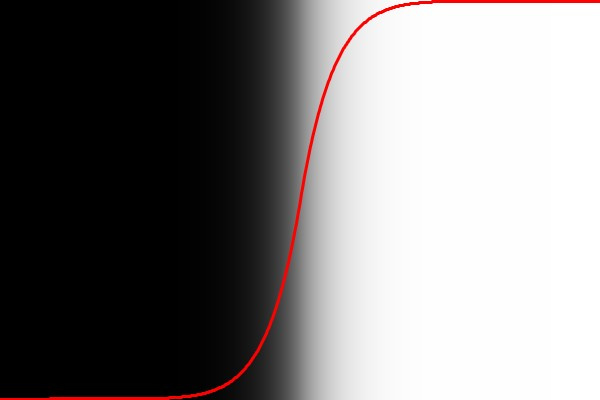

# Constructor Functions

The EasyEase Class can be initialized in different ways, enhancing flexibility and customization

There are 3 different constructor functions  each of them initializes an instances of the Class according to the provided arguments 

## Constructor #1 - default constructor

Constructs an instance of the EasyEase Class expecting only ```this```, a reference to the current Sketch,  as a argument.

It assigns default values for the global [parameters](./globalParameters.md) like ```intesity```, ```totalLength```, ```curveSpan```, ```delay``` and ```frameRate```.


### Example:

```java
import easy.ease.*;

//construct an instance of the EaseEase Class called curve
// using "this" as a reference to the current sketch
EasyEase curve = new EasyEase(this);

void setup() {
  size(600, 400);
  loadPixels();
  for (float x = 0; x < width; x++) {
    for (float y = 0; y < height; y++) {
      int index = int(x + y * width);
      color c = color(curve.inOutSine( x / width)*255);
      pixels[index] = c;
    }
  }
  updatePixels();
}

```

<div class="exampleWindow">
  <div class="title">
      <div class="dot red"></div>
      <div class="dot amber"></div>
      <div class="dot green"></div>
        <p >defaultConstructor.pde</p>
  </div>


</div>


### Syntax

```java

EasyEase curve = new EasyEase( this );


```

### Parameters

**```this```** (PApplet) the current sketch


### Returns

Object

<br>
<br>
<br>
<br>
<br>


## Constructor #2 -  with exponential intensity

Constructs an instance of the EasyEase Class expecting

-  ```this``` as a reference to the current sketch, and 
- a  ```float``` value for the ```intensity``` 

as arguments.

It assigns default values for other global [parameters](./globalParameters.md) ```intesity```, ```totalLength```, ```curveSpan```, ```delay``` and ```frameRate```.


### Example:

```java
import easy.ease.*;

// construct an instance of the EaseEase Class called curve
// passing "this" as a reference to the current sketch
// and a float value for the intensity

float intensity = 9.2;  // the exponential value of the curve
EasyEase curve = new EasyEase(this, intensity);

void setup() {
  size(600, 400);
  loadPixels();
  for (float x = 0; x < width; x++) {
    for (float y = 0; y < height; y++) {
      int index = int(x + y * width);
      color c = color(curve.inOut( x / width)*255);
      pixels[index] = c;
    }
  }
  updatePixels();
}

```

<div class="exampleWindow">
  <div class="title">
      <div class="dot red"></div>
      <div class="dot amber"></div>
      <div class="dot green"></div>
        <p >2nd_Constructor.pde</p>
  </div>



</div>


### Syntax

```java

EasyEase curve = new EasyEase(this, intensity ); 


```
### Parameters

**```this```** (PApplet) the current sketch

**```intensity```** (float) The intensity / exponential value of the easing curve.

### Returns

Object

<br>
<br>
<br>
<br>
<br>


# Constructor #3  -  with exponential intensity and time related parameters

Constructs an instance of the EasyEase Class expecting 
- ```this``` as a reference to the current sketch,
- a ```float``` value for the ```intensity``` ,
-  a  ```float``` value for the ```totalLength``` ,
-  a  ```float``` value for the ```curveSpan``` ,
-  a  ```float``` value for the ```delay```

 as arguments.

 It assigns the  default value for the global [parameter](./globalParameters.md) ```frameRate```.


### Example:

```java
import easy.ease.*;

// construct an instance of the EaseEase Class called curve
// passing "this" as a reference to the current sketch
// and float values for the intensity, totalLength, 
// curveSpan and delay

float intensity = 4.3;  // the exponential value of the curve
float totalLength = 1; // the total length of the interpolation
float curveSpan = 0.6; // the span of the easing curve
float delay = 0.4; // the delay before the curve starts bending 
EasyEase curve = new EasyEase(this, intensity, totalLength, curveSpan, delay);

void setup() {
  size(600, 400);
loadPixels();
  for (float x = 0; x < width; x++) {
    for (float y = 0; y < height; y++) {
      int index = int(x + y * width);
      color c = color(curve.out( (x / width))*255);
      pixels[index] = c;
    }
  }
  updatePixels();
}

```

<div class="exampleWindow">
  <div class="title">
      <div class="dot red"></div>
      <div class="dot amber"></div>
      <div class="dot green"></div>
        <p >3rd_Constructor.pde</p>
  </div>


</div>


### Syntax

```java

EasyEase curve = new EasyEase(this, intensity, totalLength, curveSpan, delay); 


```
### Parameters

**```this```** (PApplet) the current sketch

**```intensity```** (float) The intensity / exponential value of the easing curve.

**```totalLength```** (float) The  total length (in seconds) of the interpolation / motion

**```curveSpan```** (float) The span (in seconds) of the easing curve.

**```delay```** (float) the delay (in seconds) before the curve starts bending

### Returns

Object

