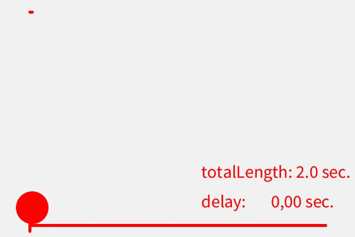

# .setDelay()


### Description 

This function is used to pass a value for the   ```delay``` variable of an EasyEase Object.

It receives a float value which should be positive and may be greater or equal than 0.0;


 
### Example

```java
import easy.ease.*;
float totalLength = 2;
EasyEase curve = new EasyEase(this, 5,2,1,1);
EasyEase reference = new EasyEase(this, 1,2,2,0);
void setup() {
  size(600, 400);
  textSize(30);
}

void draw() {
  background(#f1f1f1);
  stroke(#ff0000);
  fill(#ff0000);
  strokeWeight(5);

  float delay = map(mouseX, 0, width, 0, totalLength);
  curve.setDelay(delay);
  //when calling setDelay inside of draw()
  // setSpan() should also be called to make sure the 
  // motion span is tuned accordingly
  curve.setSpan(totalLength-delay);

  float ptCurve_X = curve.linear(frameCount/60.0, 50, width-50) ;
  float ptCurve_Y = height - curve.inOut(frameCount/60.0, 50, height-50) ;
  ellipse(ptCurve_X, ptCurve_Y, 50, 50 );

  text ("totalLength: "+curve.getTotalLength()+" sec.", 340, 300);
  text ("delay:       "+String.format("%.2f", delay)+" sec.", 340, 350);
  line(0, 380, width, 380);
  line(mouseX, 380-10, mouseX, 380+10);
  line(50,20,reference.inOut(frameCount/60.0, 50,width-50),20);
}

```


<div class="exampleWindow">
  <div class="title">
      <div class="dot red"></div>
      <div class="dot amber"></div>
      <div class="dot green"></div>
      <p >setDelay.pde</p>
  </div>



</div>


### Syntax

```myCurve.setDelay(delay) ```

### Parameters

**```delay```** (float)  the amout of delay in seconds before the motion starts


### Return

**void**


### Related


- [3rd Constructor](constructors.md#constructor-3-with-exponential-intensity-and-time-related-parameters)

- [.setTotalLenght()](./tools/setTotalLength.md)

- [.setSpan()](./tools/setSpan.md)

