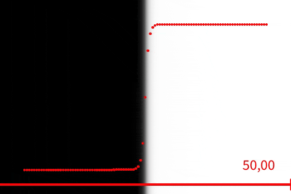

# .setIntensity()


### Description 

This function is used to pass a value for the   ```intensity``` variable of an EasyEase Object.

It affects the result of the curve bending only for: [**Exponential**](../methods.md#exponential-easing), [**Back**](../methods.md#back-easing) and [**Circular**](../methods.md#circular-easing) easing methods

it expects a float value which can be eventually any value; although in order to obtain reasonable results according to the desired easing method, it is suggested to consult [this table](#intesity-table)

 
### Examples

```java
import easy.ease.*;

EasyEase curve = new EasyEase(this);

void setup() {
  size(600, 400);
}

void draw() {
  background(255);
  stroke(#ff0000);
  fill(#ff0000);
  strokeWeight(5);
  
  float intensity = map(mouseX, 0, width, -10,50);
  curve.setIntensity(intensity);

  loadPixels();
  for (float i = 0; i < width; i++) {
    for (float j = 0; j < height; j++) {
      int index = int(i + j * width);
      color c = color( curve.inOut( i / width, 0, 255) );
      pixels[index] = c;
    }
  }
  updatePixels();

  for (float i = 0; i < 1; i+=0.01) {
    float ptCurve_X = map(i, 0, 1, 50, width-50) ;
    float ptCurve_Y = height - curve.inOut(i, 50, height-50) ;
    point(ptCurve_X, ptCurve_Y );
  }

  text (intensity, 550,350);
}

```


<div class="exampleWindow">
  <div class="title">
      <div class="dot red"></div>
      <div class="dot amber"></div>
      <div class="dot green"></div>
      <p >setIntensity.pde</p>
  </div>



</div>


### Intesity table


### Syntax

```myCurve.setIntensity(intensity) ```

### Parameters

**```intensity```** (float)  the exponetial factor of the curve 


### Return

**void**


### Related

[2nd Constructor](../constructors.md#constructor-2---with-exponential-intensity)
[3rd Constructor](../constructors.md#constructor-3---with-exponential-intensity-and-time-related-parameters)
